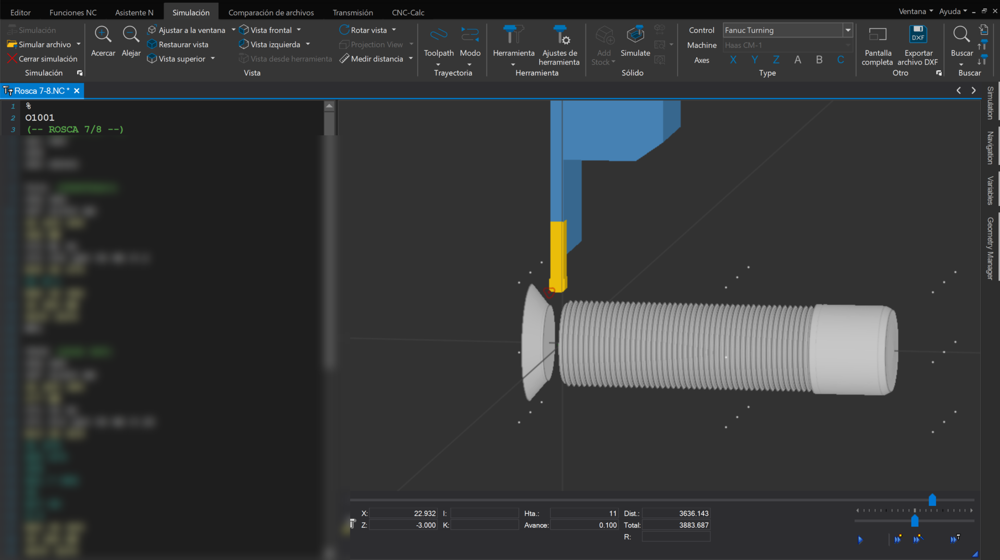

# CNC Lathe Programming – Portfolio

This repository showcases my work as a **CNC Programmer** specialized in Fanuc controllers.  
The following image is a simulation from **Cimco Edit** of a threading operation.

---

## 📸 Project Example

---

## 📌 About Me
- CNC Lathe programming (Fanuc G-Code).  
- Simulation and verification in Cimco Edit.  
- Experience with threading, facing, and complex operations.  

---

## 🔒 Note
The actual **G-Code is not shared**, only simulation previews are shown for portfolio purposes.
